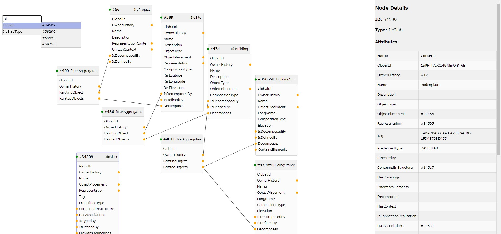

# IFC graph viewer

IFC ファイルのグラフ可視化拡張機能

## 動作環境

以下で確認

- Windows 11
- Visual Studio Code Version 1.101.2
- npm 10.9.2

## 使い方簡易説明

- VS Code で IFC ファイルをテキストとして開き、右クリックメニューまたはコマンドパレットで `Open IFC Graph Viewer` を実行
- または VS Code のファイルエクスプローラ上で IFC ファイルを右クリックし `Open IFC Graph Viewer` を実行
  - 対応しているファイル形式は `.ifc` のみ
- ノードを選択すると画面右にノードの情報が表示される
- Shift+ドラッグでノードを複数選択できる
- ノードの黄色の丸をドラッグすることで、接続先のノードを展開される
- ノードを選択した状態で Delete キーを押すとノードが削除される
- 右クリックを押すと検索ウィンドウが表示される
  - 検索ウィンドウの ID を選択すると右クリックした場所にノードが表示される
- マウスホイールで表示の拡大縮小ができる
