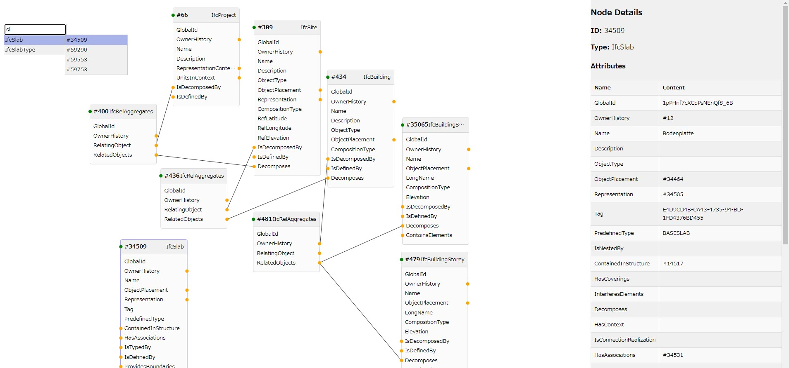

# IFC graph viewer

IFCファイルのグラフ可視化拡張機能

## 動作環境

以下で確認

- Windows 11
- Visual Studio Code Version 1.101.2
- npm 10.9.2

## 使い方簡易説明

- コマンドパレットで`Open IFC Graph Viewer`を実行
- 「ファイルの選択」からIFCファイルを選択する
  - 対応しているファイル形式は `.ifc` のみ
- ノードを選択すると画面右にノードの情報が表示される
- Shift+ドラッグでノードを複数選択できる
- ノードの黄色の丸をドラッグすることで、接続先のノードを展開される
- ノードを選択した状態でDeleteキーを押すとノードが削除される
- 右クリックを押すとエンティティの検索ウィンドウが表示される
  - 検索ウィンドウのエンティティIDを選択すると右クリックした場所にノードが表示される
- マウスホイールで表示の拡大縮小ができる
